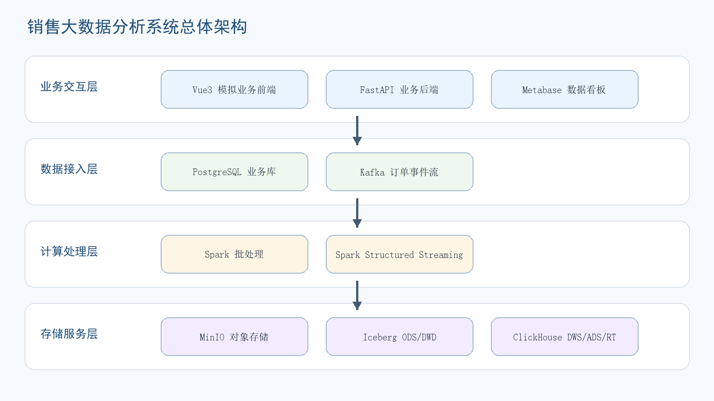

# Beginner-Friendly Sales Analytics Data Engineering Project

A beginner-friendly data engineering practice project built during undergraduate study. It simulates an end-to-end sales analytics workflow on a single machine, helping learners understand how business orders become historical and realtime dashboard metrics through source databases, Kafka events, Spark jobs, lakehouse tables, ClickHouse serving tables, and Metabase visualization.

## Highlights

- Designed as a learning and reference project for students and beginners.
- Implements both historical batch analytics and minute-level realtime analytics.
- Uses a layered data model: ODS, DWD, DWS, ADS, and RT.
- Integrates PostgreSQL, Apache Spark, Apache Iceberg, MinIO, Kafka, ClickHouse, Metabase, FastAPI, and Vue 3.
- Provides a simulated business frontend where a user can log in, browse products, and submit orders.
- Sends new business orders to Kafka and processes them with Spark Structured Streaming.
- Serves dashboard tables from ClickHouse and visualizes them in Metabase.
- Includes data quality checks for row counts, amount consistency, null keys, duplicate keys, and rate ranges.

## Architecture



The system has three main parts:

- `analytics-platform`: infrastructure, SQL schemas, batch jobs, streaming jobs, and quality checks.
- `apps/business-api`: FastAPI service that writes orders to PostgreSQL and publishes Kafka events.
- `apps/business-web`: Vue 3 frontend for login, product browsing, cart, and order submission.

## Data Flow

```text
Business Web
  -> FastAPI
  -> PostgreSQL operational tables
  -> Spark batch extraction
  -> MinIO + Iceberg ODS/DWD
  -> ClickHouse DWS/ADS
  -> Metabase dashboard

Business Web
  -> FastAPI
  -> Kafka order events
  -> Spark Structured Streaming
  -> ClickHouse RT tables
  -> Metabase realtime dashboard cards
```

## Repository Layout

```text
.
├── analytics-platform/
│   ├── docker-compose.yml
│   ├── requirements.txt
│   ├── scripts/
│   ├── spark-jobs/
│   ├── sql/
│   └── tools/
├── apps/
│   ├── business-api/
│   └── business-web/
├── assets/
│   └── figures/
├── docs/
│   ├── ARCHITECTURE.md
│   ├── DATA_MODEL_AND_METRICS.md
│   ├── RUNBOOK.md
│   ├── TECH_STACK.md
│   └── PROJECT_SCOPE.md
└── .env.example
```

## Quick Start

1. Start infrastructure services:

```powershell
cd analytics-platform
docker compose up -d
```

2. Create and activate a Python environment:

```powershell
conda create -n bigdata-sales python=3.11 -y
conda activate bigdata-sales
pip install -r analytics-platform/requirements.txt
pip install -r apps/business-api/requirements.txt
```

3. Run the batch pipeline:

```powershell
cd analytics-platform
python .\scripts\run_batch_pipeline.py --small --run-quality-checks
```

4. Start the realtime Spark stream:

```powershell
cd analytics-platform
python .\spark-jobs\run_realtime_clickhouse_stream.py
```

5. Start the business API:

```powershell
cd apps\business-api
uvicorn main:app --host 127.0.0.1 --port 8001 --reload
```

6. Start the Vue frontend:

```powershell
cd apps\business-web
npm install
npm run dev
```

7. Open:

```text
Business frontend: http://127.0.0.1:5173
Metabase:          http://localhost:3000
ClickHouse:        http://localhost:8123
MinIO console:     http://localhost:9001
```

## Reproducibility and Verification

This repository is designed so that a reviewer can understand the runnable path before cloning the project, and can verify it step by step after cloning it.

The runnable evidence is organized in four ways:

- Clear startup commands are provided in `Quick Start` and `docs/RUNBOOK.md`.
- The complete data flow is shown in `Architecture` and `Data Flow`.
- Verification scripts are included for infrastructure, batch processing, realtime streaming, and data quality checks.
- Demonstration images are stored in `assets/figures/` to show the intended architecture and dashboard output.

Recommended verification path:

```powershell
cd analytics-platform
docker compose up -d
python .\scripts\verify_iceberg_minio.py
python .\scripts\kafka_order_event_smoke_test.py
python .\scripts\run_batch_pipeline.py --small --run-quality-checks
python .\spark-jobs\run_realtime_clickhouse_stream.py --trigger available-now
```

Expected results:

- Docker services start successfully.
- Spark can write to and read from Iceberg tables on MinIO.
- Kafka can create the `sales.order_events` topic and consume test events.
- The batch pipeline creates ODS, DWD, DWS, and ADS outputs.
- Data quality checks report row-count, amount, null-value, and duplicate-key status.
- Realtime events are written into ClickHouse RT tables for Metabase dashboards.

## Demo Credentials

This repository only contains local demo credentials for reproducible development. Do not use them in production.

See `.env.example` for the default local values.

## Dashboard Metrics

Historical dashboard cards:

- Daily sales amount
- Channel conversion rate
- User lifetime value
- Repeat purchase rate
- Product contribution
- Abnormal refund rate

Realtime dashboard cards:

- Latest realtime order events
- Minute sales trend
- Minute event trend
- Minute realtime summary

## Documentation

- [Architecture](docs/ARCHITECTURE.md)
- [Data model and metrics](docs/DATA_MODEL_AND_METRICS.md)
- [Runbook](docs/RUNBOOK.md)
- [Technology stack](docs/TECH_STACK.md)
- [Project scope](docs/PROJECT_SCOPE.md)
- [GitHub upload guide](docs/GITHUB_UPLOAD_GUIDE.md)

## Project Positioning

This project is positioned as an undergraduate practice project and a beginner-friendly reference implementation. It is suitable for learning, demonstration, and portfolio presentation because it makes a complete data engineering workflow visible on one laptop.

It demonstrates practical data engineering ability in these areas:

- system design,
- data modeling,
- batch and stream processing,
- service integration,
- dashboard delivery,
- debugging and observability,
- technical documentation.

It is not a production-grade system or a performance benchmark. Its goal is to make the architecture, data flow, and engineering trade-offs understandable, reproducible, and easy to extend for learners.
